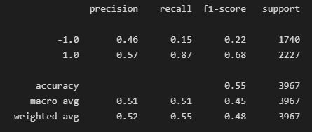

# Machine Learning Trading Bot
## Evaluation Report
### Module 14

 The purpose of the assignment is to create an algorithmic trading bot that learns and adapts to new data and evolving markets. 

Ideally each iteration and tweak of the machine learning will improve the profits for the Algorithmic Trader.

The results of the experiments are below:

---

# SVM Trading Algorithm 

## Actual Returns Vs SVM Strategy Returns

The algorith perfoms slightly better than the Actual Returns however the recall ratio is only 4%

## Classification Report

---

# SVM Trading Algorithm Modified SMA (20 days and 200 days)

## Actual Returns Vs Modified SVM Strategy Returns

The algorith performed poorly over time when compared to the Actual Returns.

The Moving averages periods would likely need to be adjusted for a better result.

## Classification Report

---

# SVM Trading Algorithm Modified SMA (5 Months of Data)

## Actual Returns Vs Modified SVM Strategy Returns

The algorith performed was highly correlated to the Actual Returns.

During 2019, the model did outperfom the previous model with only 3 months of data, but overall, did not perfom as well.

## Classification Report

---

# AdaBoost Trading Algorithm

## Actual Returns Vs AdaBoost Model  Strategy Returns

The algorith appears to be nagitively correlated to the Actual Returns.

This could be a better method to deploy during a bear market as it perfromed significantly better than the "Actual Returns" when there was strong negative price action.

## Classification Report

---